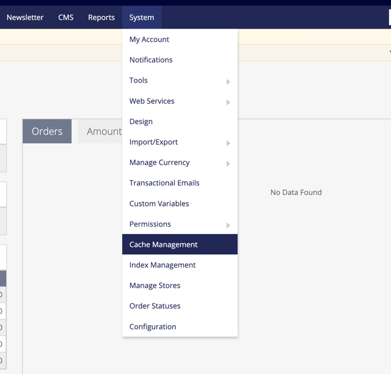
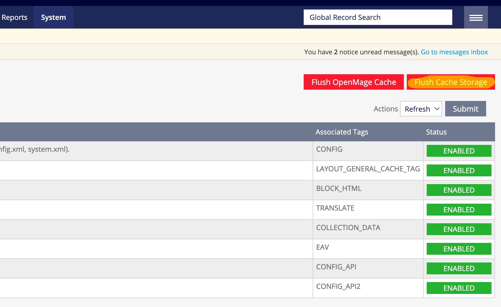
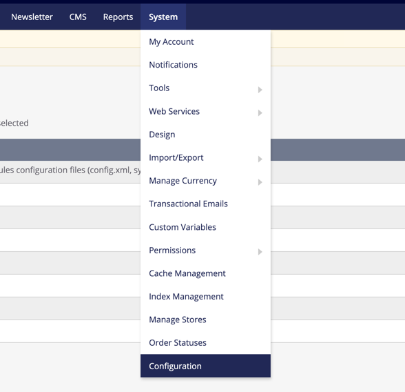
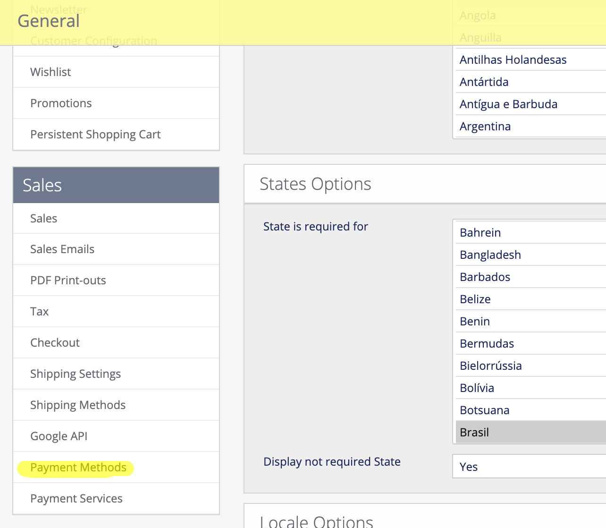
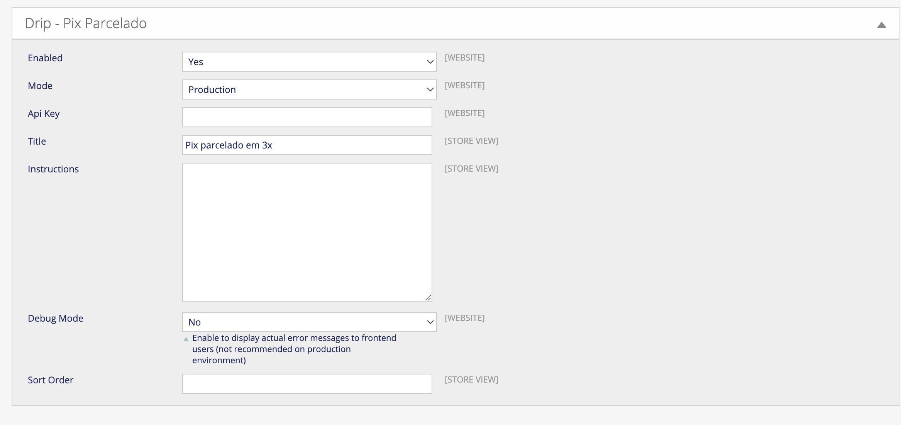

# Módulo Drip para Magento 1
Módulo de Integração de Pix Parcelado para o e-commerce Magento 1.x

## Versões Suportadas
- 1.9.x

## Instalando
1. Entre na pasta raiz onde se encontra instalado o magento.
2. Faça download da versao mais recente do plugin com o comando `wget https://github.com/DripOrg/magento1-plugin/archive/refs/tags/v0.1.0.zip`
3. Descompacte a pasta com o comando `unzip v0.1.0.zip`
4. Copie todos os arquivos da pasta descompactada para a raiz do seu projeto com o comando `cp -r magento1-plugin-0.1.0/* .`
5. Vá até `Sistema > Gerenciar Cache`;

6. Clique em **Liberar Cache Armazenado** para limpar o cache do Magento;

7. Vá até `Sistema > Configuração`

8. Vá até `Vendas > Métodos de Pagamento`

9. Encontre o método `Drip - Pix Parcelado`

10. Deixe a opção `Enabled` como `Yes/Sim`
11. Selecione o modo pertencente a sua chave (`Developer` ou `Production`)
12. Adicione a sua chave no campo `Api Key`
13. Clique em `Salvar Configuraçoes`

*Pronto, a Drip está configurada e ativa como método de pagamento na sua loja*
